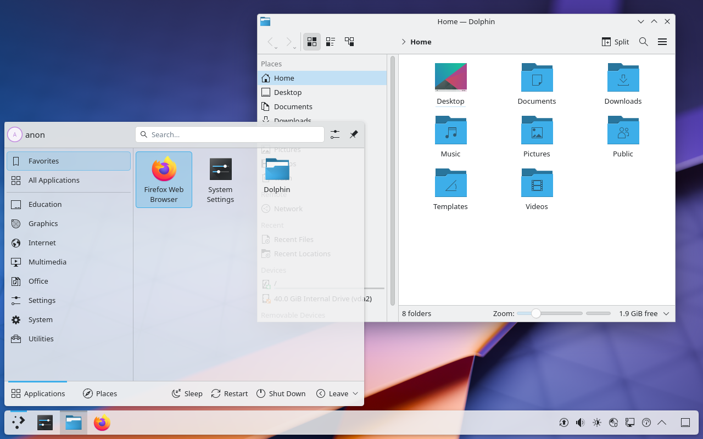

>[!WARNING]
>Work in progress... 
>Use at your own risk!

# Void Desktop Build Scripts

## How to use

Make sure you're using Void Linux. Clone the repository, run `setup-repo.rsh` ***ONLY ONCE!***

Run `sudo ./mkiso.sh -b cinnamon` to create a ISO of the Cinnamon variant, `sudo ./mkiso.sh -b xfce` to create a ISO of the XFCE variant or `sudo ./mkiso.sh -b kde` to create a ISO of the KDE variant.

