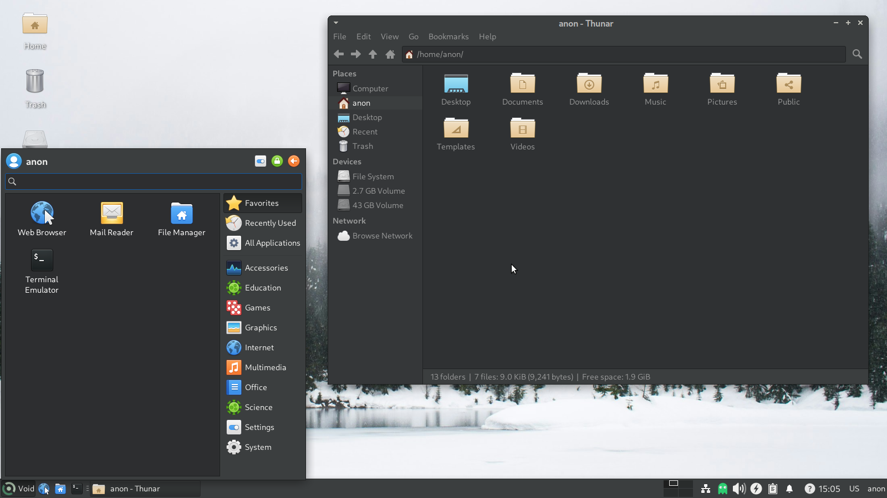

# Void Desktop Build Scripts

## What is this?

This is a modified void-mklive repository which builds a custom x86-64-glibc ISO that installs the XFCE desktop just like regular Void, but comes pre-configured with sane defaults, Greybird GTK theme and elementary-xfce icon set (must be [manually added](https://github.com/shimmerproject/elementary-xfce) after downloading the repo and extracted into included/usr/share/icons) and extra software depending on which ISO is used.  

While this is mainly meant to be used by me, the goal of this project is to provide a great desktop experience for anyone looking to try out Void Linux for the first time without having to go through all the customization and configuration themselves.
